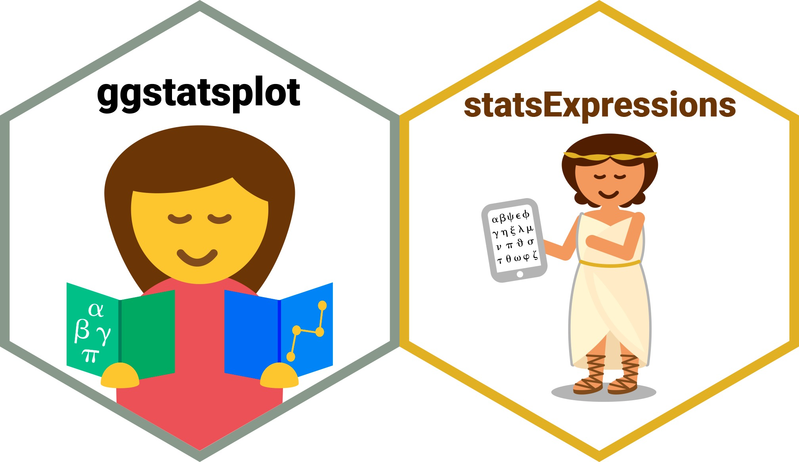

```{r setup, include=FALSE}
knitr::opts_chunk$set(
  warning = FALSE,
  message = FALSE,
  dpi = 300,
  out.width = "100%"
)

options(htmltools.dir.version = FALSE)
```

```{r xaringanExtra-search, echo=FALSE}
xaringanExtra::use_search(show_icon = TRUE)
```

```{css, echo=FALSE}
.remark-code {
  font-size: 0.7em;
}

.remark-code, .remark-inline-code {
  font-family: 'JetBrainsMono-Regular';
}
```

### Note Before

I put together these slides in a hurry<sup>*</sup> because (unexpectedly to me) a number of people were curious about refactoring when I tweeted yesterday.

.footnote[<sup>*</sup>I'm on holiday until 31st of August and don't have time to polish these slides further. 😿]

<blockquote class="twitter-tweet" data-theme="dark"><p lang="en" dir="ltr">{ggstatsplot}&#39;s codebase was &gt; 10,000 lines of code 2 yrs ago. Since then, I&#39;ve slowly, painfully, and painstakingly refactored it without compromising on functionality.<br><br>And now it&#39;s only ~ 1,600 lines of code!<br><br>Refactoring code is a strangely rewarding (and additive) process 🙃</p>&mdash; Indrajeet Patil (@patilindrajeets) <a href="https://twitter.com/patilindrajeets/status/1421844249277091842?ref_src=twsrc%5Etfw">August 1, 2021</a></blockquote> <script async src="https://platform.twitter.com/widgets.js" charset="utf-8"></script>

---

class: inverse, center, middle

# Prologue
The Unbearable Heaviness of Software

---

### What does the software do?

You don't need to know much about `{ggstatsplot}` to follow these slides, except that it produces `ggplot2` plots with statistical analysis embedded in the plot. For more information, see these [slides](https://indrajeetpatil.github.io/ggstatsplot_slides/slides/ggstatsplot_presentation.html#1). Here is an example plot:

```{r, echo=FALSE, out.width="60%", fig.width=8}
library(ggstatsplot)
library(palmerpenguins)

ggbetweenstats(penguins, species, flipper_length_mm,
  xlab = "Penguin species", ylab = "Flipper length (in mm)",
  title = "Flipper bill length by species"
)
```

---

### State of codebase in 2019: > 20K lines of code 🙀

<blockquote class="twitter-tweet" data-theme="dark"><p lang="en" dir="ltr">What is the state of the ggplot2 package ecosystem?<br><br>There are 120k lines of R code (!) across ggplot2 and its 40+ extensions at <a href="https://t.co/DJCdhDTJo0">https://t.co/DJCdhDTJo0</a><br><br>ggstatsplot &amp; ggplot2 make up 1/3 of the total.<br><br>My package, ggdark, is the 4th smallest. 🙂<a href="https://twitter.com/hashtag/tidytuesday?src=hash&amp;ref_src=twsrc%5Etfw">#tidytuesday</a> <a href="https://twitter.com/hashtag/rstats?src=hash&amp;ref_src=twsrc%5Etfw">#rstats</a> <a href="https://twitter.com/hashtag/dataviz?src=hash&amp;ref_src=twsrc%5Etfw">#dataviz</a> <a href="https://t.co/FVbg8vROte">pic.twitter.com/FVbg8vROte</a></p>&mdash; Neal Grantham 🆖 (@nsgrantham) <a href="https://twitter.com/nsgrantham/status/1194676877425725440?ref_src=twsrc%5Etfw">November 13, 2019</a></blockquote> <script async src="https://platform.twitter.com/widgets.js" charset="utf-8"></script>

---

### "What's the problem with that?!"

- Hard to maintain a large codebase
- Adding new features becomes difficult

> *The goal of software architecture is to minimize the human resources required to build and maintain the required system.*
>
> -- Robert C. Martin (*Clean Architecture*, p.5)

### "What does refactoring<sup>*</sup> get you?"

- Forces you to think about design patterns in your code
- Improves the code you will write in the future

.footnote[<sup>*</sup>refactoring: restructuring code without changing its external behavior]

I am deliberately being terse here since these slides are about *how* I refactored the code, rather than *why*.

---

class: inverse, center, middle

# Preconditions
"Big things have small beginnings"

---

# Unit tests

--
Three things to do before refactoring<br>
<br>
--
**100 % code coverage**<br>
--
**100 % code coverage**<br>
--
**100 % code coverage**<br>
--
<br>

Start with unit tests and check if literally every line of code is doing its job properly.

Try your absolute best to [*break* your own code](https://en.wikipedia.org/wiki/Defensive_programming) and add unit tests for every instance of corner case you or the users may find. 

*Now* you can start refactoring<sup>*</sup>!

.footnote[<sup>*</sup>Needless to say, it's a good practice to do refactoring in a separate branch and then make a pull-request to the `master`/`main` branch. This will protect you from `commit`-ing code that inadvertently changes software behavior.]

---

class: inverse, center, middle

# Ruthlessly DRY

---

### DRYing `{ggstatsplot}`

DRY or Don't repeat yourself [principle](https://en.wikipedia.org/wiki/Don%27t_repeat_yourself) dictates reducing repetition of software patterns by replacing it with abstractions.

During refactoring:

- Code repeated even **twice** was abstracted out into its own helper function.

- Inside function body, all unnecessary assignments were avoided. A new object was created only if it was used in more than one place.

```{r, eval=FALSE}
# before: 4 lines of code
x_vec <- data %>% dplyr::pull({{ x }})
x_bw <- (max(x_vec) - min(x_vec)) / sqrt(length(x_vec))
y_vec <- data %>% dplyr::pull({{ y }})
y_bw <- (max(y_vec) - min(y_vec)) / sqrt(length(y_vec))

# after: 3 lines of code
.binwidth <- function(x) (max(x) - min(x)) / sqrt(length(x))
x_bw <- .binwidth(data %>% dplyr::pull({{ x }}))
y_bw <- .binwidth(data %>% dplyr::pull({{ y }}))
```

---

class: inverse, center, middle

# Divide and conquer
East India Company style of coding

---

### Break a big package into smaller packages

To facilitate maintenance of the package, it was broken into two packages-
- [`ggstatsplot`](https://indrajeetpatil.github.io/ggstatsplot/): all things **graphics**
- [`statsExpressions`](https://indrajeetpatil.github.io/statsExpressions/): all things **statistics**

This makes adding new functionality much easier, since graphical functions can be prepared even if statistical backend isn't ready, and vice versa.

```{r, echo=FALSE, out.width="70%"}

```

---

### Don't reinvent, borrow smaller wheels

- Resist temptation to duplicate efforts by writing functions for doing things that other packages already do, unless, of course, the whole point of the package is to (e.g.) provide an alternative with better performance. Yes, you should be cautious about number of dependencies, but that's not the *only* thing you should worry about. I'd highly recommend this excellent [talk](https://www.youtube.com/watch?v=mum13N7CGUI&ab_channel=RStudio) by Jim Hester to better understand trade-offs involved.

- Instead carefully choose a dependency to rely on. If it is missing features you desire, instead of adding them in your own software, contribute to the dependency itself. Not only does this make your software lighter, your contributed code could now be useful for other reverse dependencies.
 
- For example, `{ggstatsplot}` used to have custom functions to compute confidence intervals for effect sizes. All of them were replaced by relying on [effectsize](https://easystats.github.io/effectsize/) or by moving some to [`WRS2`](https://cran.r-project.org/web/packages/WRS2/index.html).

- By this point, I am either co-author or contributor on a quarter of `ggstatsplot`'s hard dependencies.

---

class: inverse, center, middle

# Functional programming

---

### Assigning functions to variables

R is a [functional language](https://adv-r.hadley.nz/fp.html) and you can take advantage of that.

For example, you can assign functions to variables. 
Note that this also makes it unnecessary to repeat oneself while specifying common arguments to different functions.

.pull-left[
```{r, eval=FALSE}
# before: 12 lines of code
foo <- function(a, b, type) {
  if (type == "p") {
    return(t.test(
      x = a,
      y = b
    ))
  }

  if (type == "np") {
    return(wilcox.test(
      x = a,
      y = b
    ))
  }
}
```
]

.pull-right[
```{r, eval=FALSE}
# after: 7 lines of code
foo <- function(a, b, type) {
  if (type == "p") .f <- t.test
  if (type == "np") .f <- wilcox.test

  return(rlang::exec(
    .f,
    x = a,
    y = b
  ))
}
```
]

---

### Execute function with arguments in a list

If a used function has a large number of arguments that you wish the user could specify, instead of specifying them *individually*, you can instead store them in a `list` and then internally splice (`!!!`) it.

.pull-left[
```{r, eval=FALSE}
# before: 8 lines of code
foo <- function(data) {
  ggplot(data, aes(wt, mpg)) +
    geom_point(
      size = 3,
      color = "red",
      stroke = 0,
      alpha = 0.5,
      na.rm = TRUE
    )
}
```
]

.pull-right[
```{r, eval=FALSE}
# after: 2 lines of code
foo <- function(data,
                point.args = list(
                  size = 3,
                  color = "red",
                  stroke = 0,
                  alpha = 0.5,
                  na.rm = TRUE
                )) {
  ggplot(data, aes(wt, mpg)) +
    exec(geom_point, !!!point.args)
}
```

]

---

class: inverse, center, middle

# Getting carried away

The following might be considered **bad coding practices** by some practitioners because they reduce code readability. I don't, so I've included them for the sake of completeness.

---

### Modify-in-place with assignment pipe `%<>%`

See: <https://magrittr.tidyverse.org/reference/compound.html>

```{r, eval=FALSE}
# before: 2 lines of code
df <- df %>%
  mutate(c = a + b)

# after: 1 line of code
df %<>% mutate(c = a + b)
```

---

### Multiple assignment using `%<-%`

See: <https://rdrr.io/cran/zeallot/man/operator.html>

```{r, eval=FALSE}
# before: 3 lines of code
x <- 1
y <- "b"
z <- TRUE

# after: 1 line of code
c(x, y, z) %<-% c(1, "b", TRUE)
```

---

class: inverse, center, middle

# Epilogue
Struggles that define you

---

### "Why didn't you use these methods in the beginning?"

- Started *learning* R in January 2017 and started working on `{ggstatsplot}` in October/November 2017, so did not have much experience with R to use advanced techiques like functional programming.

- Trained in Physics and then worked as a researcher in Social Neuroscience and Social Psychology, which means no formal education or training<sup>*</sup> in Computer Science or Software Development. Needed to make these mistakes to learn these lessons the hard way.

.footnote[<sup>*</sup>If you are someone with formal training in these subjects and find any of the methods/principles discussed here are a bad idea, instead of a subtweet or a snide remark, I'd appreciate if you can file an issue (<https://github.com/IndrajeetPatil/Refactoring-ggstatsplot/issues>), so that I can flag the respective content with a warning.]

---

class: inverse, center, middle

# Resources

---

### Tools

None of this would have been possible without the following excellent tools/services:

- `testthat`: <https://testthat.r-lib.org/>
- `vdiffr`: <https://vdiffr.r-lib.org/>
- `covr`: <https://covr.r-lib.org/>
- `codecov`: <https://about.codecov.io/>
- `lintr`: <https://github.com/jimhester/lintr/blob/master/README.md>
- `github-actions`: <https://github.com/r-lib/actions>
- `styler`: <https://styler.r-lib.org/>
- `travis-ci`<sup>*</sup>: <https://travis-ci.com/>
- `appveyor`<sup>*</sup>: <https://www.appveyor.com/>

.footnote[<sup>*</sup>I don't use these anymore in favor of github-actions, but before github-actions arrived on the scene, these continuous integration services were essential part of my workflow.]

---

### Videos

<iframe width="400" height="280" src="https://www.youtube.com/embed/7oyiPBjLAWY" title="YouTube video player" frameborder="0" allow="accelerometer; autoplay; clipboard-write; encrypted-media; gyroscope; picture-in-picture" allowfullscreen></iframe>

<iframe width="400" height="280" src="https://www.youtube.com/embed/D4auWwMsEnY" title="YouTube video player" frameborder="0" allow="accelerometer; autoplay; clipboard-write; encrypted-media; gyroscope; picture-in-picture" allowfullscreen></iframe>

---

### Books

```{r, echo=FALSE}
knitr::include_graphics("images/books.jpeg")
```

---

layout: false

class: inverse, center, middle

# Find me at...

.font100[

[`r emo::ji("bird")` @patilindrajeets](http://twitter.com/patilindrajeets)

[`r emo::ji("computer")` @IndrajeetPatil](http://github.com/IndrajeetPatil)  

[`r emo::ji("link")` https://sites.google.com/site/indrajeetspatilmorality/](https://sites.google.com/site/indrajeetspatilmorality/)  

[`r emo::ji("mail")` patilindrajeet.science@gmail.com](mailto:patilindrajeet.science@gmail.com)

]

---

layout: false

class: inverse, center, middle

# The End 👋

To access code for these slides, see-

<https://github.com/IndrajeetPatil/Refactoring-ggstatsplot/>
