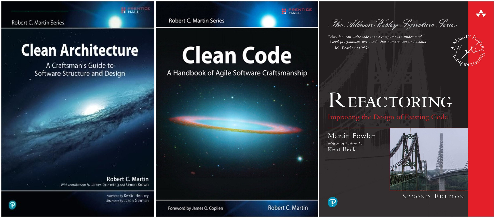

```{r setup, include=FALSE}
knitr::opts_chunk$set(
  warning = FALSE,
  message = FALSE,
  dpi = 300,
  out.width = "100%"
)

options(htmltools.dir.version = FALSE)
```

```{r xaringanExtra-search, echo=FALSE}
xaringanExtra::use_search(show_icon = TRUE)
```

# Note Before

I put together these slides in a hurry<sup>*</sup>, because (unexpectedly to me) a number of people were curious about this refactoring.

.footnote[<sup>*</sup>I'm on holiday until 31st of August and don't have time to polish these slides further. 😿]

<blockquote class="twitter-tweet" data-theme="dark"><p lang="en" dir="ltr">{ggstatsplot}&#39;s codebase was &gt; 10,000 lines of code 2 yrs ago. Since then, I&#39;ve slowly, painfully, and painstakingly refactored it without compromising on functionality.<br><br>And now it&#39;s only ~ 1,600 lines of code!<br><br>Refactoring code is a strangely rewarding (and additive) process 🙃</p>&mdash; Indrajeet Patil (@patilindrajeets) <a href="https://twitter.com/patilindrajeets/status/1421844249277091842?ref_src=twsrc%5Etfw">August 1, 2021</a></blockquote> <script async src="https://platform.twitter.com/widgets.js" charset="utf-8"></script>

---

class: inverse, center, middle

# Prologue

---

### What does `{ggstatsplot}` do?

You don't need to know much about `{ggstatsplot}` to follow these slides, except that it produces `ggplot2` plots with statistical analysis embedded in the plot. For more, see these [slides](https://indrajeetpatil.github.io/ggstatsplot_slides/slides/ggstatsplot_presentation.html#1). Here is an example plot:

```{r, echo=FALSE, out.width="60%", fig.width=8}
library(ggstatsplot)
library(palmerpenguins)

ggbetweenstats(penguins, species, flipper_length_mm,
               xlab = "Penguin species", ylab = "Flipper length (in mm)",
               title = "Flipper bill length by species")
```

---

### State of codebase in 2019

<blockquote class="twitter-tweet" data-theme="dark"><p lang="en" dir="ltr">What is the state of the ggplot2 package ecosystem?<br><br>There are 120k lines of R code (!) across ggplot2 and its 40+ extensions at <a href="https://t.co/DJCdhDTJo0">https://t.co/DJCdhDTJo0</a><br><br>ggstatsplot &amp; ggplot2 make up 1/3 of the total.<br><br>My package, ggdark, is the 4th smallest. 🙂<a href="https://twitter.com/hashtag/tidytuesday?src=hash&amp;ref_src=twsrc%5Etfw">#tidytuesday</a> <a href="https://twitter.com/hashtag/rstats?src=hash&amp;ref_src=twsrc%5Etfw">#rstats</a> <a href="https://twitter.com/hashtag/dataviz?src=hash&amp;ref_src=twsrc%5Etfw">#dataviz</a> <a href="https://t.co/FVbg8vROte">pic.twitter.com/FVbg8vROte</a></p>&mdash; Neal Grantham 🆖 (@nsgrantham) <a href="https://twitter.com/nsgrantham/status/1194676877425725440?ref_src=twsrc%5Etfw">November 13, 2019</a></blockquote> <script async src="https://platform.twitter.com/widgets.js" charset="utf-8"></script>

---

### "What's the problem with that?!"

- Hard to maintain a large codebase
- Finding corner cases becomes difficult
- Adding new features becomes diffiult

> *The goal of software architecture is to minimize the human resources required to build and maintain the required system.*
Robert C. Martin (*Clean Architecture*, p.5)

### "What does refactoring get you?"

- Forces you to think about design patterns in your code

---

class: inverse, center, middle

# Preconditions

---

# Three things to do before refactoring

--
1. 100 % code coverage<br>
--
2. 100 % code coverage<br>
--
3. 100 % code coverage<br>
--
<br>
Try your absolute best to *break* your own code and add tests for every instance

---

class: inverse, center, middle

# Ruthlessly DRY

---

class: inverse, center, middle

# Divide and conquer

---

### Don't reinvent wheel

- Resist temptation to duplicate efforts by writing custom functions for doing things that other packages already do. Yes, you should be cautious about number of dependencies, but that's not the *only* thing you should worry about. I'd highly recommend [this talk](https://www.youtube.com/watch?v=mum13N7CGUI&ab_channel=RStudio) by Jim Hester to better understand this trade-off.

- Instead choose a dependency and use its functionality. If it is missing features you desire, instead of adding them in your own software, contribute to the dependency itself.
 
- For example, `{ggstatsplot}` used to have custom functions to compute confidence intervals for effect sizes but all of these were removed in favor an [excellent package](https://easystats.github.io/effectsize/) dedicated to computing effect sizes and their confidence intervals.

- At this point, I am either co-author or contributor on a number of `ggstatsplot`'s hard dependencies.

---

class: inverse, center, middle

# Functional programming

---

class: inverse, center, middle

# Getting carried away

The following might be considered **bad coding practices** by some practitioners because they reduce readability of the code, especially for contributors. But I'd still like to mention them for the sake of completeness.

---

### Modify-in-place with assignment pipe `%<>%`

See: <https://magrittr.tidyverse.org/reference/compound.html>

```{r, eval=FALSE}
# before: 2 lines of code
df <- df %>%
  mutate(c = a + b)

# after: a single like of code
df %<>% mutate(c = a + b)
```

---

### Multiple assignment using `%<-%`

See: <https://rdrr.io/cran/zeallot/man/operator.html>

```{r, eval=FALSE}
# before: 3 lines of code
x <- 1
y <- "b"
z <- TRUE

# after: 1 line of code
c(x, y, z) %<-% c(1, "b", TRUE)
```

---

class: inverse, center, middle

# Resources

---

# Videos

<iframe width="560" height="315" src="https://www.youtube.com/embed/7oyiPBjLAWY" title="YouTube video player" frameborder="0" allow="accelerometer; autoplay; clipboard-write; encrypted-media; gyroscope; picture-in-picture" allowfullscreen></iframe>

---

# Books

```{r, echo=FALSE}

```

